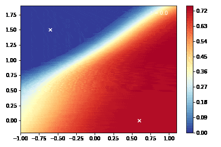
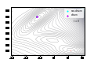

# Collective Variable Problem: Solving Backward Fokker-Planck Equations

This repository contains code for solving the collective variable problem for molecular systems. This is done by using neural network PDE solver methods for backward Fokker-Planck equations. The methods emplyed leverage on stochastic path theory by using the Forward-Backward Stochastic Differential Equation (FBSDE) method. The implementation leverages PyTorch and PyTorch Lightning to create and train neural network models representing the committor function solution of the equation.

## References
Some papers for reference:
- https://arxiv.org/abs/1804.07010
- https://arxiv.org/abs/2012.07924
- https://pubs.aip.org/aip/jcp/article/156/18/184108/2841162/Brownian-bridges-for-stochastic-chemical-processes
- https://openreview.net/pdf?id=H1lPUiRcYQ
- https://www.nature.com/articles/s43588-023-00428-z

## Introduction

The collective variable problem refers to finding low-dimensional representations (collective variables) that capture the essential features of complex dynamical systems. This project tackles the collective variable problem by simulating the dynamics of N particles in various potential landscapes using Langevin dynamics and solving backward Fokker-Planck equations.

The code provided includes implementations of the Langevin dynamics solver, neural network models for the potential landscape (MLP with various activation functions), and utilities for data handling and FBSDE solving.

## Installation

1. Clone the repository:

git clone https://github.com/AleFalla/Learning-commitors-with-neural-FBSDE.git
cd collective-variable-problem

2. Install the required dependencies:

pip install -r requirements.txt

3. (Optional) Install any additional requirements for your specific setup or environment.

## Usage

To use this codebase, follow these steps:

1. Define the potential landscape function (e.g., Mueller_Potential).

2. Configure the neural network architecture for your potential model (e.g., MLP_sigmoided, Hitting_prob_model, etc.).

3. Prepare the initial conditions for the particles using the Create_uniform_initial function.

4. Set up your data using the Data_Handler class.

5. Train the model using PyTorch Lightning and the provided training loops.

## Examples

Here's an example of how to use the code to solve the collective variable problem:

```python

# Define the potential landscape function
import torch

def Mueller_Potential(x):
    # ... implementation ...

# Configure the neural network architecture
mlp_args = {
    # ... specify the arguments ...
}

boundary_args = {
    # ... specify the arguments ...
}

FBSDE_args = {
    # ... specify the arguments ...
}

model_args = {
    'mlp_args': mlp_args, 
    'boundary_args': boundary_args, 
    'FBSDE_args':  FBSDE_args,
    # ... specify other arguments ...
}

# Prepare the initial conditions
initial_state = torch.tensor([[-0.6, 1.5]], device='cuda')
final_state = torch.tensor([[.6, -0]], device='cuda')
box_size = 7.0  # Example box size

initial_conditions = Create_uniform_initial(pow2_samples=10, initial_state=initial_state, final_state=final_state, box_size=box_size)

# Set up data
data = Data_Handler()
data = data.load_datas_from_files()
training_set = data['train_dataset']
validation_set = data['val_dataset']

# Create data loaders
train_loader = DataLoader(training_set, batch_size=50, shuffle=True)
valid_loader = DataLoader(validation_set, batch_size=int(0.25 * len(validation_set)), shuffle=True)

# Train the model
# ... code to set up the model ...

trainer = pl.Trainer(accelerator="gpu", devices=1, max_epochs=20000, gradient_clip_val=.5, gradient_clip_algorithm="norm")
trainer.fit(model, train_loader, valid_loader) 
```
## Animations of first results

| GIF 1                                | GIF 2                                |
| ----------------------------------- | ----------------------------------- |
|  |  |


## Contributing

Contributions to this project are welcome! If you find any issues or have suggestions for improvement, please feel free to open an issue or submit a pull request.

## License

This project is licensed under the MIT License - see the LICENSE file for details.